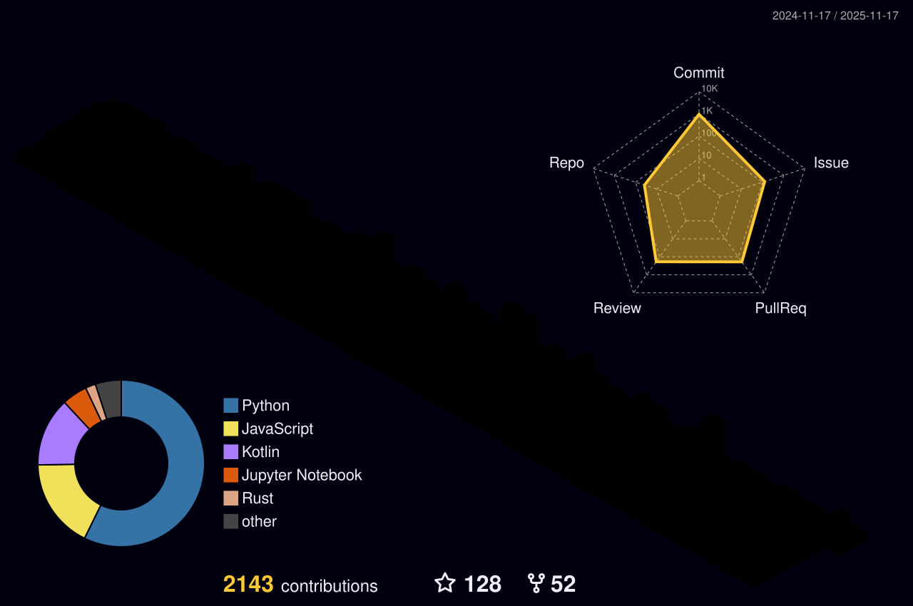
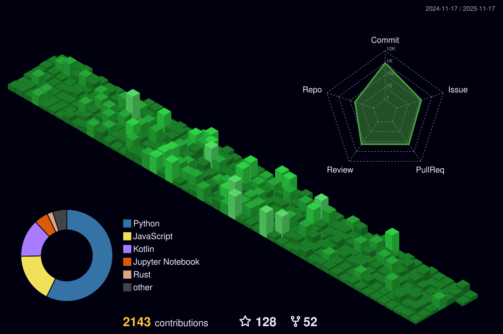
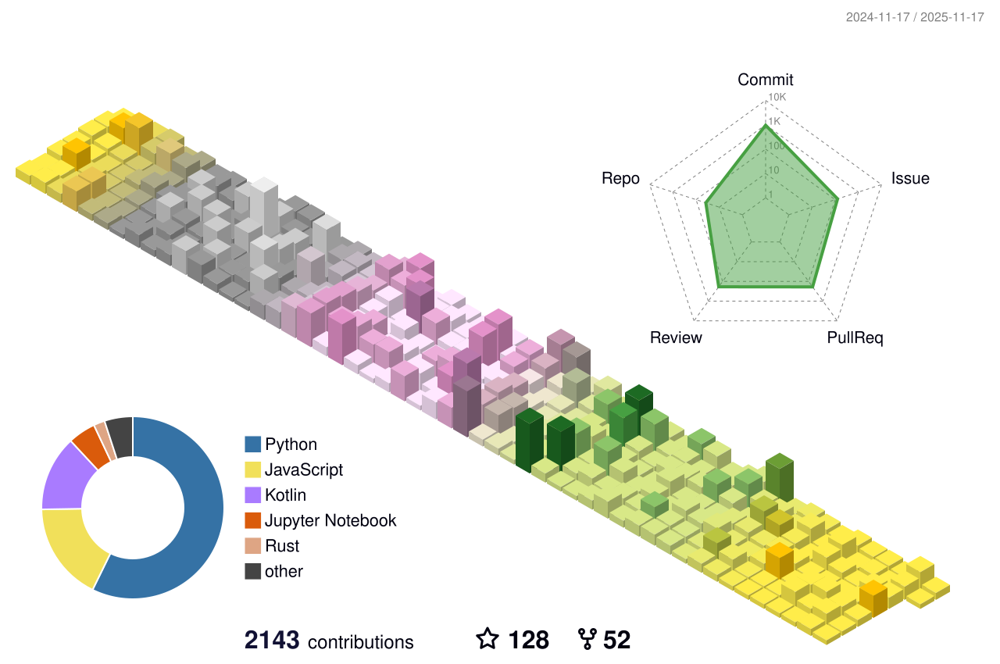
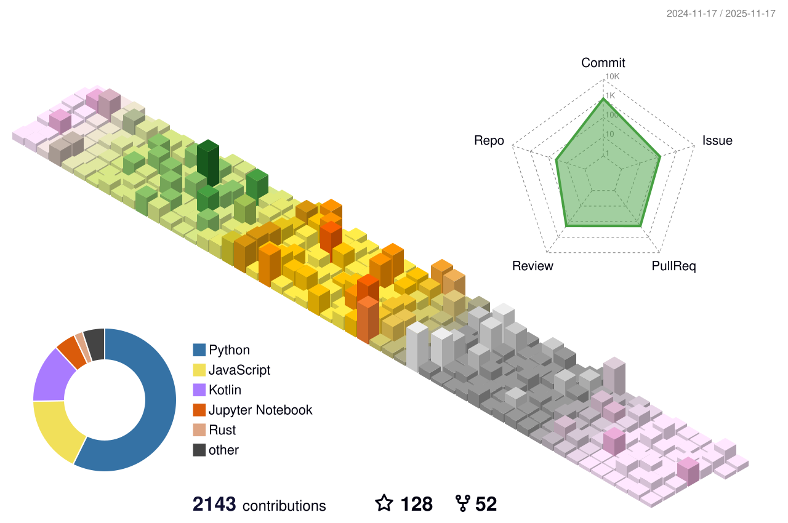

<div align="center">
  <picture>
    <source media="(prefers-color-scheme: dark)" srcset="https://capsule-render.vercel.app/api?type=waving&color=0:4A71D9,100:00c6ff&height=220&section=header&text=S%C3%BCleyman%20Mercan&fontSize=54&fontColor=ffffff&animation=fadeIn&fontAlignY=36&desc=.NET%20Backend%20%7C%20Cloud%20%7C%20DevOps&descAlignY=60&descSize=18">
    <source media="(prefers-color-scheme: light)" srcset="https://capsule-render.vercel.app/api?type=waving&color=0:E8ECF5,100:C9D6FF&height=220&section=header&text=S%C3%BCleyman%20Mercan&fontSize=54&fontColor=111111&animation=fadeIn&fontAlignY=36&desc=.NET%20Backend%20%7C%20Cloud%20%7C%20DevOps&descAlignY=60&descSize=18">
    
  </picture>
</div>

<div align="center">
  <picture>
    <source media="(prefers-color-scheme: dark)" srcset="https://readme-typing-svg.demolab.com?font=Fira+Code&size=22&pause=1100&color=00c6ff&center=true&vCenter=true&width=780&lines=%3E_hello%2C+I'm+S%C3%BCleyman+%F0%9F%91%8B;%3E_.NET+Backend+%7C+API+Design+%7C+Clean+Architecture;%3E_Docker+%7C+Linux+%7C+GitHub+Actions;%3E_Terraform+%7C+Cloud+Deployments+(AWS+%2F+Oracle+Cloud)">
    <source media="(prefers-color-scheme: light)" srcset="https://readme-typing-svg.demolab.com?font=Fira+Code&size=22&pause=1100&color=4A71D9&center=true&vCenter=true&width=780&lines=%3E_hello%2C+I'm+S%C3%BCleyman+%F0%9F%91%8B;%3E_.NET+Backend+%7C+API+Design+%7C+Clean+Architecture;%3E_Docker+%7C+Linux+%7C+GitHub+Actions;%3E_Terraform+%7C+Cloud+Deployments+(AWS+%2F+Oracle+Cloud)">
    
  </picture>
</div>

<p align="center">
  <a href="https://github.com/slymanmrcan">
    
  </a>
  <a href="https://github.com/slymanmrcan?tab=stars">
    
  </a>
  <a href="https://linkedin.com/in/slymanmrcan">
    
  </a>
  <a href="mailto:slymanmrcan@gmail.com">
    
  </a>
</p>

---

## 👋 About

Backend-focused engineer in the .NET ecosystem, building REST APIs, data layers, and deployment-ready setups.  
I like clean architecture, automation, and pragmatic DevOps practices.

---

## 🧠 `whoami`

```csharp
public class Suleyman
{
    public string Role => ".NET Backend / Cloud Infrastructure";
    public string[] Focus => new[]
    {
        "REST API Design",
        "Clean Architecture",
        "PostgreSQL & MSSQL",
        "Dockerized Development",
        "GitHub Actions CI/CD",
        "Terraform (IaC) basics",
        "Cloud Deployments (AWS / Oracle Cloud)"
    };

    public string Motto => "Simple systems scale. Automated systems survive.";
}
```

---

## 🚀 Featured Projects

<p align="center">
  <a href="https://github.com/slymanmrcan/kasatakip">
    
  </a>
  <a href="https://github.com/slymanmrcan/github-infra">
    
  </a>
</p>
<p align="center">
  <a href="https://github.com/slymanmrcan/BaseLibraryKit">
    
  </a>
  
</p>

Multi-tenant backend systems, Terraform-based GitHub automation, reusable .NET libraries, and offline-first mobile experiments.

> Note: `eduCenter` and `PrivFlow` are currently commercial/private repositories. Source code will be shared after public release.

---

## 🧰 Stack

<p align="center">
  
</p>

<details>
  <summary><b>Extra badges</b></summary>
  <br/>
  <p>
    
    
    
    
    
    
    
  </p>
</details>

---

## 📊 GitHub Analytics

<p align="center">
  
  
</p>
<p align="center">
  
</p>

<details>
  <summary><b>Contribution graph</b></summary>
  <br/>
  
</details>

---

## 🧊 3D Contribution Graph (Data Source)

These 3D visuals are generated directly from your GitHub contribution history.

- Workflow: `.github/workflows/gh-profile-3d-contrib.yml`
- Action: `yoshi389111/github-profile-3d-contrib@0.7.0`
- Schedule: every day at `18:00 UTC` (`21:00` Türkiye time)
- Username: `${{ github.repository_owner }}`
- Token: `${{ secrets.GITHUB_TOKEN }}`

The action pulls contribution data through the GitHub API/GraphQL and creates multiple SVG themes under `profile-3d-contrib/`.

### Active Theme (dark/light auto switch)

<p align="center">
  <picture>
    <source media="(prefers-color-scheme: dark)" srcset="./profile-3d-contrib/profile-night-rainbow.svg">
    <source media="(prefers-color-scheme: light)" srcset="./profile-3d-contrib/profile-green.svg">
    
  </picture>
</p>

### Theme Preview

<p align="center">
  
  
</p>
<p align="center">
  
  
</p>

### Quick Theme Switch

```markdown

```

Alternatives:

- `./profile-3d-contrib/profile-green.svg`
- `./profile-3d-contrib/profile-night-view.svg`
- `./profile-3d-contrib/profile-gitblock.svg`
- `./profile-3d-contrib/profile-season.svg`

---

## 🔗 Contact

- Website: https://smtechlab.net
- GitHub Org: https://github.com/smtechlabteam
- LinkedIn: https://linkedin.com/in/slymanmrcan
- E-mail: slymanmrcan@gmail.com

---

## 🧭 Engineering Motto

`Simple systems scale.`  
`Automated systems survive.`  
`Clean architectures win.`

<div align="center">
  <picture>
    <source media="(prefers-color-scheme: dark)" srcset="https://capsule-render.vercel.app/api?type=waving&color=0:4A71D9,100:00c6ff&height=130&section=footer">
    <source media="(prefers-color-scheme: light)" srcset="https://capsule-render.vercel.app/api?type=waving&color=0:E8ECF5,100:C9D6FF&height=130&section=footer">
    
  </picture>
</div>
